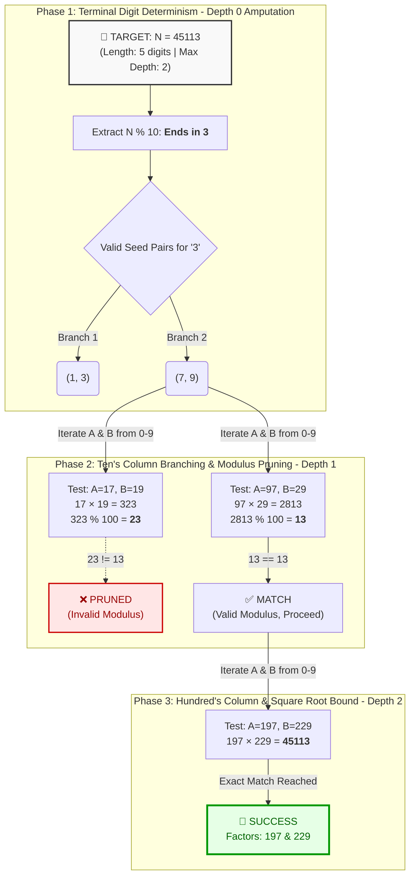

# MONUMENTAL_FAULT (old project)

---

# RSA Prime Factoring Research: Cryptanalysis via Right-to-Left Base-10 Multiplication Reversal

### Abstract

This project details a non-traditional integer factorization algorithm that approaches the decomposition of semiprimes not through division-based reduction, but via a deterministic reversal of the long-multiplication process. By treating factorization as a base-10 constraint satisfaction problem, the algorithm employs a 10-ary depth-first search (DFS) tree to reconstruct prime factors digit-by-digit. Integrating modulus pruning, terminal digit determinism, and dynamic length bounding, the method heavily mitigates the combinatorial explosion inherent in brute-force cryptographic attacks.

---

### 1. Introduction

The security of the RSA cryptosystem relies entirely on the asymmetric computational complexity of integer factorization. While multiplying two large prime numbers ($p$ and $q$) to produce a modulus ($N$) is computationally trivial, reversing the process to derive $p$ and $q$ from $N$ scales exponentially in difficulty.

Classical factorization methods treat the modulus as a monolithic mathematical entity. The Reverse Multiplication Algorithm approaches the problem from an architectural mindset—treating multiplication as a deterministic cascade of positional operations. By running this algorithmic "machine" in reverse, factors can be reconstructed strictly through right-to-left digit matching, heavily restricting the search space before full integer evaluation is required.

### 2. Core Methodology: Positional Modulus Matching

The fundamental principle of the algorithm relies on the fact that in base-10 arithmetic, the $k$-th digit of a product is entirely dictated by the rightmost $k$ digits of its factors.

Instead of guessing full integers, the algorithm initiates a recursive traversal, moving right-to-left. For any given depth $k$, candidate partial factors $A$ and $B$ are valid if and only if they satisfy the modulus constraint:

$(A \times B) \pmod{10^k} \equiv N \pmod{10^k}$

If the constraint is met, the branch is viable, and the algorithm recurse to depth $k+1$. If the constraint fails, the branch is immediately pruned. This eliminates the need to manually track carry-over arithmetic, as the integer modulo math natively handles the overflow cascade.

### 3. Algorithmic Optimizations

#### 3.1. Terminal Digit Determinism (Depth 0 Amputation)

Because RSA requires massive prime numbers, any valid prime factor greater than 5 cannot end in an even number or 5. Valid candidate prime factors ($p$ and $q$) are strictly constrained to end in 1, 3, 7, or 9. Consequently, $N$ must also always end in 1, 3, 7, or 9.

By mapping out the base-10 multiplication of the allowed prime terminal digits, the algorithm entirely bypasses the initial depth of the search tree. Assuming symmetry breaking ($A \le B$), the viable starting pairs can be statically seeded based on $N \pmod{10}$:

* **For $N \equiv 1 \pmod{10}$:** Seed pairs are $(1, 1)$, $(3, 7)$, and $(9, 9)$.
* **For $N \equiv 3 \pmod{10}$:** Seed pairs are $(1, 3)$ and $(7, 9)$.
* **For $N \equiv 7 \pmod{10}$:** Seed pairs are $(1, 7)$ and $(3, 9)$.
* **For $N \equiv 9 \pmod{10}$:** Seed pairs are $(1, 9)$, $(3, 3)$, and $(7, 7)$.

The algorithm parses the target's terminal digit, loads the corresponding seed pairs, and initiates the recursive depth-first search directly at the ten's column ($depth = 1$), skipping the widest and most computationally wasteful tier of combinatorial branching.

#### 3.2. The Square Root Bound (Dynamic Length Culling)

To prevent basic brute-force trial division, RSA key generation standards dictate that the prime factors $p$ and $q$ must be roughly the same bit length. Consequently, the length of the factors will always cluster around the geometric center ($\sqrt{N}$).

The algorithm capitalizes on this structural rule by projecting the maximum possible length of the candidate factors based on the base-10 length of the product $N$. The maximum recursive depth of the DFS tree is dynamically locked to:

$D_{max} = \lfloor \frac{\text{length}(N)}{2} \rfloor$

Any branch attempting to append digits beyond this depth is abandoned, restricting the search exclusively to the mathematically viable center.

---


### 4. Compilation & Execution

This project utilizes the Boost C++ libraries for arbitrary-precision arithmetic. To compile and run on a Linux environment (e.g., Ubuntu):

**1. Install Boost Headers:**

```bash
sudo apt update
sudo apt install libboost-all-dev

```

**2. Compile the Source Code:**

```bash
g++ -O3 factor.cpp -o factor

```

**3. Execute:**

```bash
./factor

```
